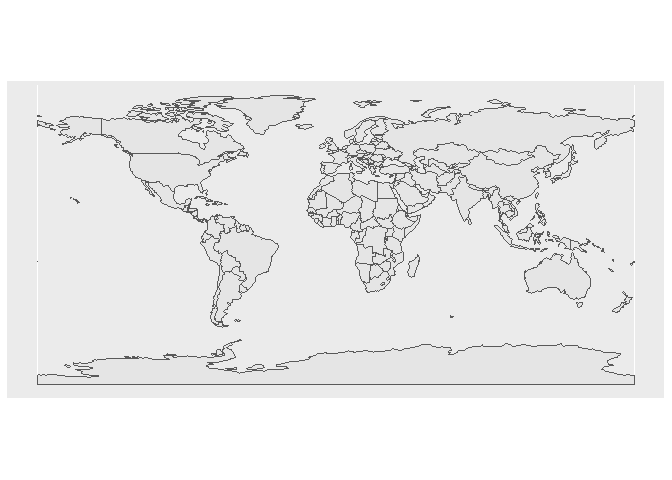
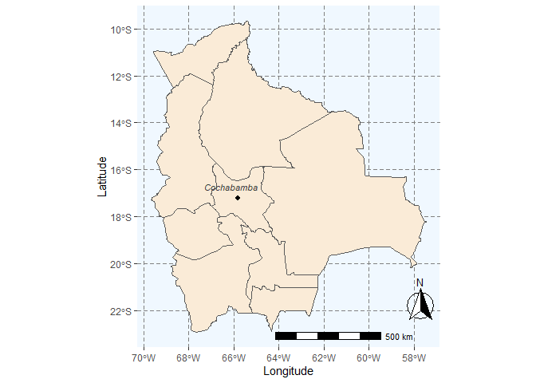
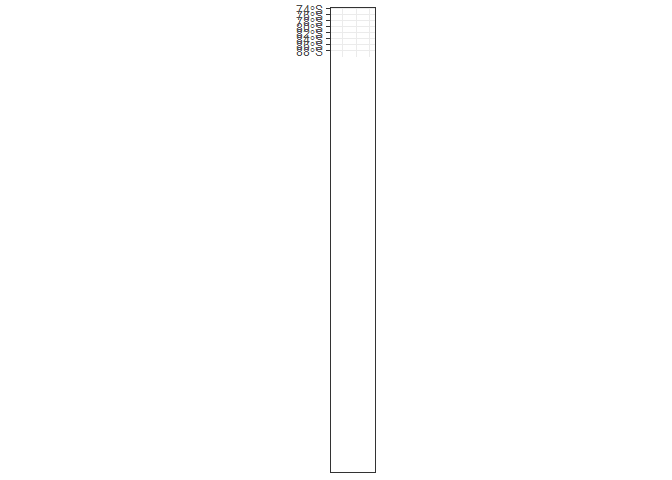
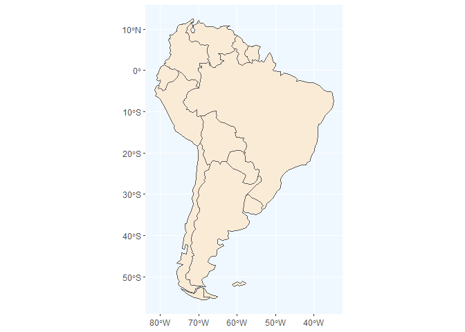
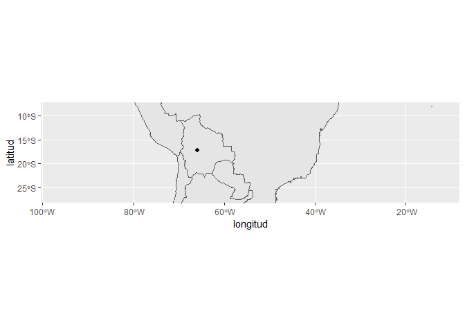
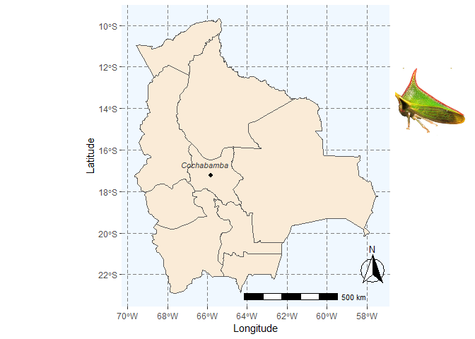
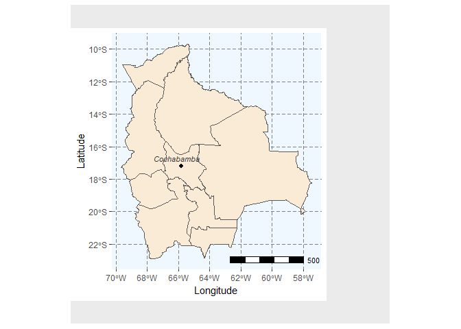
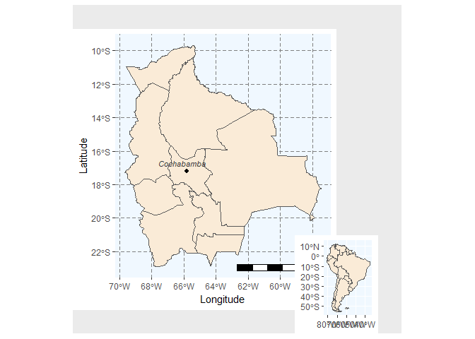

## Cargar los paquetes


```r
library(rnaturalearth)
library(rnaturalearthdata)
library(sf)
```

```
## Linking to GEOS 3.9.1, GDAL 3.3.2, PROJ 7.2.1; sf_use_s2() is TRUE
```

```r
library(tidyverse)
```

```
## ── Attaching packages ─────────────────────────────────────── tidyverse 1.3.1 ──
```

```
## ✔ ggplot2 3.3.6     ✔ purrr   0.3.4
## ✔ tibble  3.1.7     ✔ dplyr   1.0.9
## ✔ tidyr   1.2.0     ✔ stringr 1.4.0
## ✔ readr   2.1.2     ✔ forcats 0.5.1
```

```
## ── Conflicts ────────────────────────────────────────── tidyverse_conflicts() ──
## ✖ dplyr::filter() masks stats::filter()
## ✖ dplyr::lag()    masks stats::lag()
```

```r
library(ggspatial)
library(ggthemes)
library(png)
```

## Map plots

You can also embed plots, for example:


## Crear primer mapa


```r
world %>%
  ggplot + geom_sf()
```

<!-- -->

```r
library(rnaturalearthhires)
 study_site <- data.frame(longitud= -65.817,latitud=-17.217)
 #View(study_site)

bol <- ne_states(country = 'Bolivia', returnclass = 'sf')
plot1 <-bol %>% 
 ggplot + geom_sf(fill= 'antiquewhite') +xlab('Longitude') +ylab('Latitude') + annotation_scale(location = "bl",width_hint = 0.40,pad_x = unit(1.8, 'in'), pad_y = unit(0.1, 'in')) +
    annotation_north_arrow(location = "bl", which_north = "true",pad_x = unit(3.4, "in"), pad_y = unit(0.3, "in"),style = north_arrow_fancy_orienteering) + theme(panel.grid.major = element_line(color = gray(.5), linetype = 'dashed', size = 0.3), panel.background = element_rect(fill = 'aliceblue')) + geom_point(data=study_site,aes(x=longitud, y=latitud),size = 3, shape = 20, fill = "blue")+ annotate(geom = 'text', x = -66.1, y = -16.7, label = 'Cochabamba', fontface = 'italic', color = 'grey22', size = 3.0)

## link of the photo https://encrypted-tbn0.gstatic.com/images?q=tbn:ANd9GcSyZuVg60hqm_yF4GbmkvyQqOxwUuS6iLroyA&usqp=CAU

plot1
```

<!-- -->

```r
#coordenadas gegráficas (-17.217,-65.817) y (-17.394,-66.157)

bol %>% ggplot +
    geom_sf() +
    coord_sf(ylim = c( -80.56, -220.43  ), xlim = c(-18.5,-34)) +theme_bw()
```

<!-- -->


```r
surame <- ne_countries(continent ='South America', returnclass = 'sf' )
plot2 <- ggplot(data=surame) + geom_sf( fill= 'antiquewhite') + theme( panel.background = element_rect(fill = 'aliceblue'))
plot2
```

<!-- -->

```r
world <- ne_countries(scale = "medium", returnclass = "sf")
class(world)
```

```
## [1] "sf"         "data.frame"
```

```r
ggplot(data = world) +
    geom_sf() +
    coord_sf(xlim = c(-100.28, -8.12), ylim = c(-7.26, -28.26), expand = FALSE)  + geom_point(data=study_site,aes(x=longitud, y=latitud),size = 3, shape = 20, fill = "blue")
```

<!-- -->

```r
library(png)
library(grid)
library(patchwork)
library(cowplot)
```

```
## 
## Attaching package: 'cowplot'
```

```
## The following object is masked from 'package:patchwork':
## 
##     align_plots
```

```
## The following object is masked from 'package:ggthemes':
## 
##     theme_map
```

```r
library(magick)
```

```
## Linking to ImageMagick 6.9.12.3
## Enabled features: cairo, freetype, fftw, ghostscript, heic, lcms, pango, raw, rsvg, webp
## Disabled features: fontconfig, x11
```

```r
img <- readPNG('Imagen2.png')
## link of the photo https://encrypted-tbn0.gstatic.com/images?q=tbn:ANd9GcSyZuVg60hqm_yF4GbmkvyQqOxwUuS6iLroyA&usqp=CAU

file_plot <- ggdraw() + draw_image(img, x= 0.4, y= 0.2, scale= 0.2) + draw_plot(plot1)
file_plot
```

<!-- -->

```r
#transform plot into a grob_object
grob_aoi <- ggplotGrob(file_plot)
class(grob_aoi)
```

```
## [1] "gtable" "gTree"  "grob"   "gDesc"
```

```r
grob_south <- ggplotGrob(plot2)
class(grob_south)
```

```
## [1] "gtable" "gTree"  "grob"   "gDesc"
```

```r
g_inset <- ggplot() +
    coord_equal(xlim = c(0, 1), ylim = c(0, 1), expand = FALSE)
g_inset
```

<!-- -->

```r
## Add the first layer of maps
g_inset +
  annotation_custom(grob_aoi,
    xmin = 0, xmax = 0.8, ymin = 0,
    ymax = 1
  )
```

<!-- -->

```r
## Adding the second layer

g_inset +
  annotation_custom(grob_aoi,
    xmin = 0, xmax = 0.8, ymin = 0,
    ymax = 1
  ) +
  annotation_custom(grob_south,
    xmin = 0.6, xmax = 1, ymin = 0,
    ymax = 0.3
  )
```

<!-- -->


